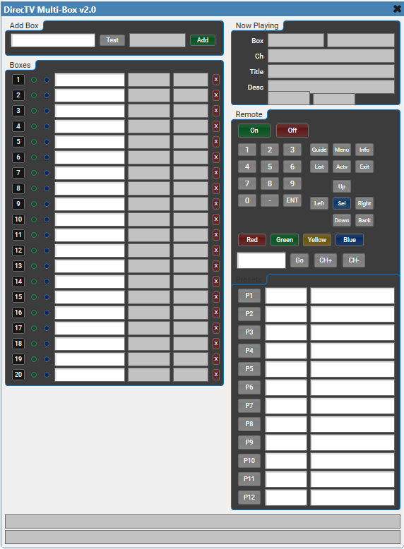
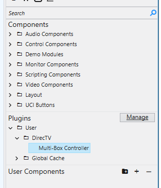
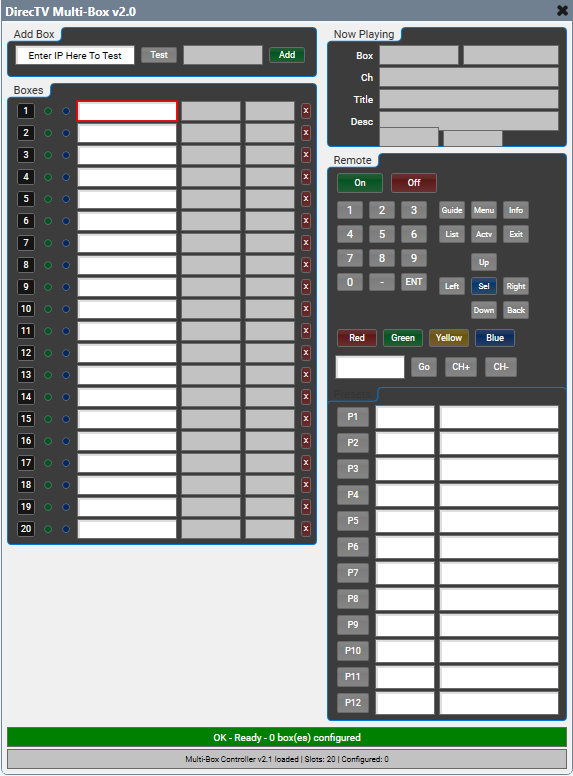
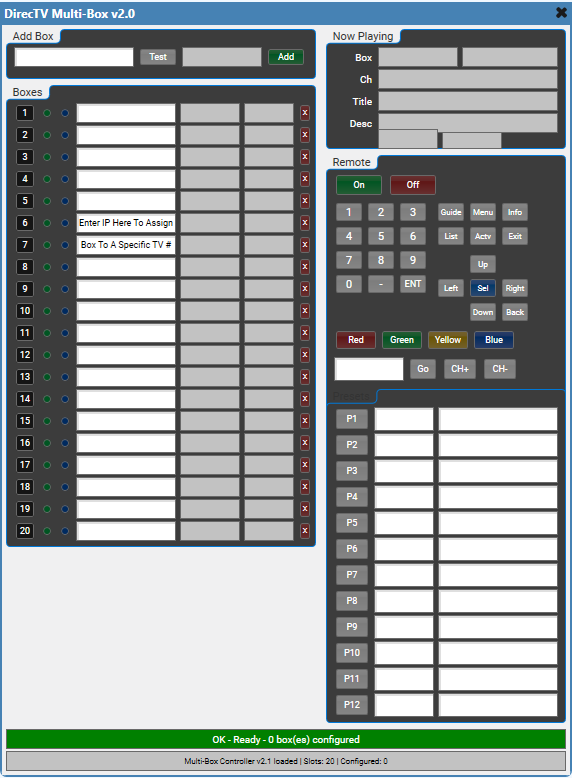
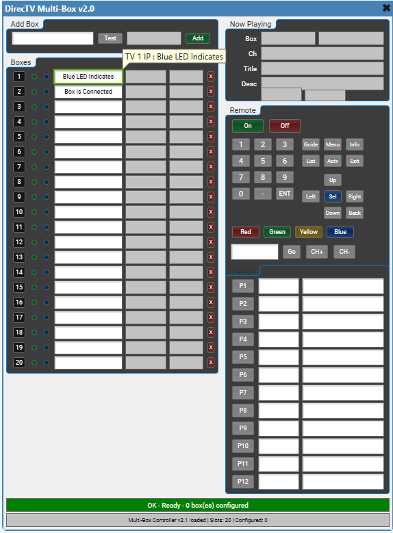
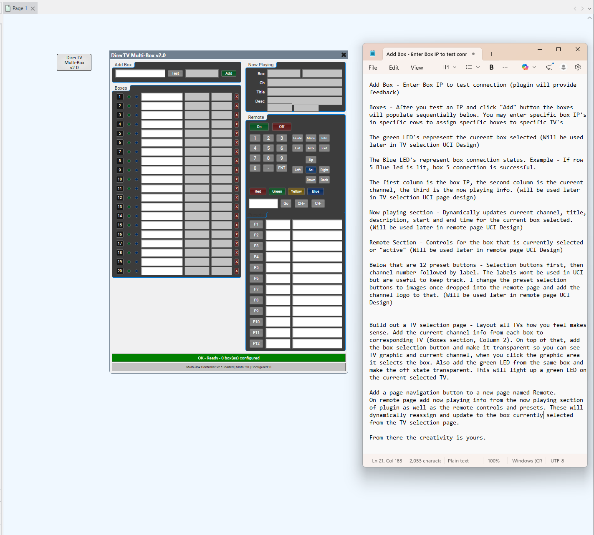

# DirecTV Multi-Box Controller

A Q-SYS Designer plugin that controls up to 32 DirecTV receivers from a single component. Built for A/V installations in bars, restaurants, and sports venues where one UCI drives many TVs.

Uses the DirecTV SHEF HTTP API (port 8080) for fast, reliable control. Per-box now playing info, a shared remote that routes to the selected box, 12 channel presets, and two-tier polling for responsive feedback.

## Installation

1. Download `DirecTV_Controller.qplugx`
2. Drop it into your Q-SYS Designer plugins folder:
   - **Mac:** `~/Documents/QSC/Q-Sys Designer/Plugins/`
   - **Windows:** `Documents\QSC\Q-Sys Designer\Plugins\`
3. Restart Q-SYS Designer
4. The plugin appears under **User → DirecTV → Multi-Box Controller** in the plugin list — drag it into your design

## Setup

1. Add the plugin to your design
2. In plugin properties, set **Box Count** to the number of receivers (1–32)
3. In the plugin UI, enter the IP address of each box in the `Box IP` fields
4. Enable **External Access** on each DirecTV receiver: Menu → Settings → Whole-Home → External Device → Allow
5. Boxes auto-connect on load. The overview pulls now playing info every 30 seconds; the selected box updates every 2 seconds.

**Add Box panel** — drop an IP in to test the connection before committing it. The plugin will tell you if the box is reachable, and you can add it to the first open slot.

**Box slots** — each row is one receiver. The row number *is* the TV number, so if you want a box tied to a specific TV on your UCI, drop its IP in the corresponding row. Left to right: the white field is the **IP**, the next field is the **current channel**, and the last is the **current title** of what's playing.

**Connection status** — the blue LED on the left of each row lights up when the plugin is connected to that box. The green LED shows which box is currently selected.

## Building the UCI

The plugin exposes every control (buttons, text fields, LEDs) in the component's control list. To build a UCI, open the plugin component and **drag controls straight from the plugin onto your UCI page** — each control you drop keeps its connection back to the plugin automatically. Then style it (size, colors, font, label, fill, stroke) in the UCI editor like any other UCI element. You don't need to manually wire anything; the plugin is the source.

### The layering technique

The trick that makes this plugin feel polished is layering transparent plugin controls on top of a venue graphic. For each TV on the floor plan:

1. **Bottom layer — TV graphic.** Place a TV image or labeled rectangle where that TV physically sits.
2. **Info layer — `Box Channel 1..N`** (and `Box Title 1..N` if space allows). Drop the read-only text on top of the graphic and style it to fit — this gives every TV a live "now playing" readout.
3. **Hit layer — `TV Select 1..N`.** Drop the select button over the whole tile. In the UCI editor, set fill and stroke to fully transparent so the button is invisible but still clickable.
4. **Feedback layer — `TV LED 1..N`.** Drop the LED on top and style it so the **off state is transparent** and the **on state is a glow, border, or tint** (e.g. a green stroke around the tile). When a TV is selected the outline lights up; unselected TVs show nothing.

Tap anywhere on the tile → TV selects → LED lights it up → current channel is already visible. Same pattern scales to dozens of TVs across multiple rooms.

## UI Pattern A: Shared remote with box selection

The typical setup — one shared remote page that controls whichever box was last selected.

**TV Selection page:**
- Build a tile per TV using the layering technique above
- Add a "Go to Remote" button that navigates to the Remote page (standard UCI page navigation)

**Remote page:**
- Drag the shared remote controls onto the page and style them as your remote: `Power`, `Channel Up`, `Channel Down`, `Nav Up/Down/Left/Right`, `Select`, `Guide`, `Info`, `Menu`, `Exit`, `Num 0–9`, etc.
- Drop `Channel Input` as a text field and `Go to Channel` as a button for direct channel entry
- Drop `Preset 1` through `Preset 12` as buttons, and `Preset Name 1–12` / `Preset Channel 1–12` as the editable name/channel text fields
- Drop `Current Channel`, `Current Program`, `Program Description`, and `Active Box` as text labels for feedback on the selected receiver

**Flow:** user taps a TV tile → selection LED outlines it → taps "Go" to navigate to the remote → remote controls now route to the selected box → user taps back to return to the floor plan.

## UI Pattern B: Per-box now playing dashboard

This is really the layering technique taken further. On the selection page, for every TV tile:

- Drop `Box Channel 1..N` — current channel number on that box
- Drop `Box Title 1..N` — current program name
- Drop `Box Online 1..N` as a status indicator (styled transparent-off / colored-on) if you want a "not connected" hint

The overview timer polls all boxes every 30 seconds so the readouts stay current without hammering the boxes. Tap any tile → it selects → navigate to the remote for full control.

## Key Controls / Pins

| Pin | Direction | Purpose |
|---|---|---|
| `Box IP 1..N` | Input | IP address per box |
| `TV Select 1..N` | Input | Select a box as active |
| `TV LED 1..N` | Output | LED feedback for selection |
| `Box Channel 1..N` | Output | Per-box current channel |
| `Box Title 1..N` | Output | Per-box current program |
| `Box Online 1..N` | Output | Per-box connection status |
| `Active Box` | Output | Number/name of selected box |
| `Current Channel` | Output | Active box channel |
| `Current Program` | Output | Active box program |
| `Program Description` | Output | Active box description |
| `Power`, `Channel Up`, `Nav Up`, etc. | Input | Remote buttons routed to active box |

## Notes

- After a channel change (number keys, channel up/down, select, prev), the plugin runs follow-up polls at 1s and 3s so the now playing info catches up quickly
- On boot the plugin auto-polls every configured box so the overview page populates without any user interaction

---

**VDA Solutions LLC** — [info@vdasolutionsny.com](mailto:info@vdasolutionsny.com)